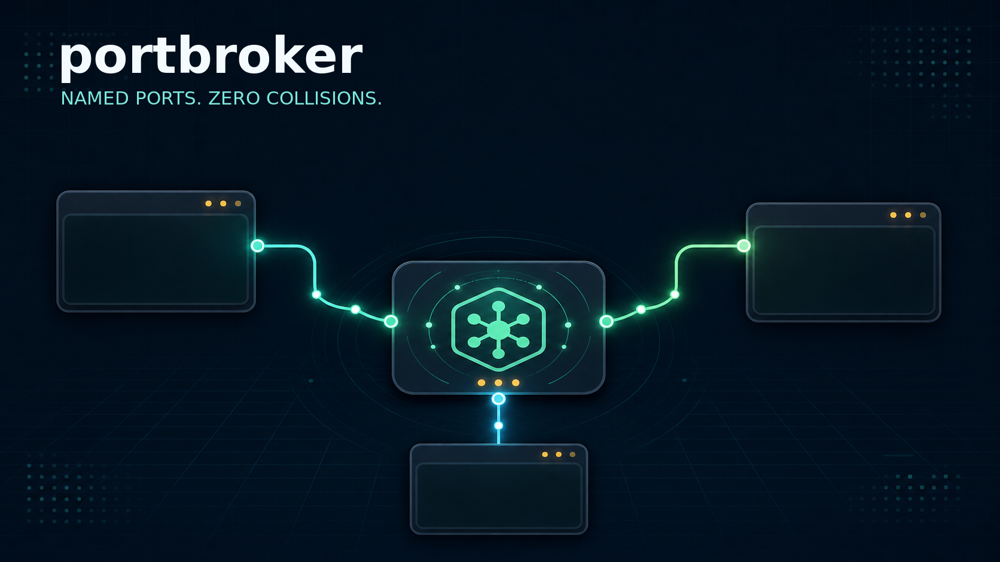
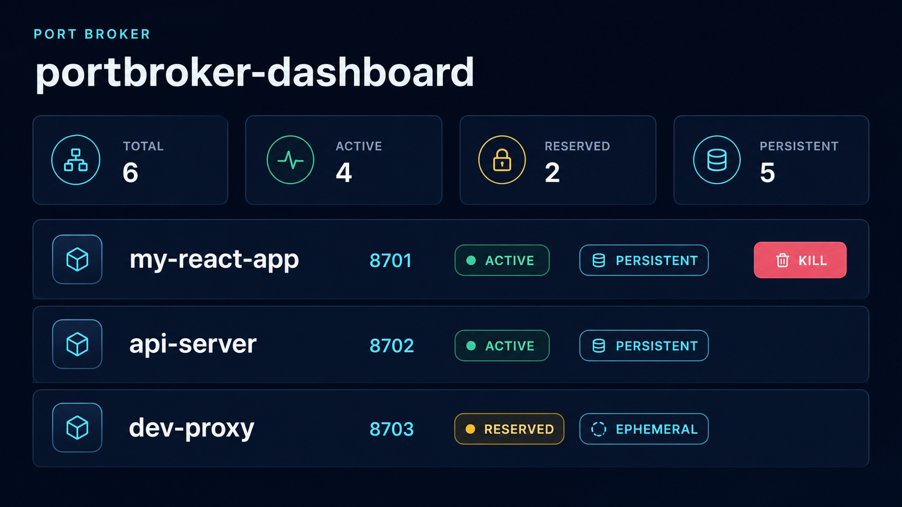

# portbroker

## Why this exists

You already have a dev server on `:3000`.
An AI coding agent starts another app, reaches for the same port, and one process wins.
Now the browser tab you trusted is pointed at the wrong server, or the agent silently stole the port your work depended on.
`portbroker` gives local services stable named reservations before anything binds.

<!--
Record demo with:
asciinema rec docs/demo.cast

Rough script:
terminal A: start a server on :3000
terminal B: agent tries to start its own server, collides
install portbroker
terminal B succeeds on a different port

Target length: ~20-30s
-->
<!-- [](https://asciinema.org/a/PORTBROKER_DEMO) -->



## Install

```bash
curl -fsSL https://raw.githubusercontent.com/tweakyourpc/portbroker/main/install.sh | sh
```

The installer requires Linux or macOS and Python 3.11 or newer. It installs the CLI, dashboard asset, and detected coding-agent instructions in your user directories.

## Quick start

```bash
PORT="$(portbroker alloc --name my-app --persistent)"
python3 -m http.server "$PORT" --bind 0.0.0.0
```

Start the dashboard in another terminal:

```bash
PORT="$(portbroker get --name portbroker-dashboard 2>/dev/null || portbroker alloc --name portbroker-dashboard --persistent)"
portbroker web --port "$PORT" --persistent
```

Open the URL printed by `portbroker web`.

## How it works with AI agents

`portbroker install-skill` detects Claude Code, Codex, and OpenCode configuration directories and installs short instructions that require port reservation before starting network services. Re-running it is safe: a managed marker prevents duplicated instructions.

```bash
portbroker install-skill
portbroker install-skill --agents codex,opencode --dry-run
```

## Has this happened to you?

Native support requests are open for [Anthropic Claude Code](https://github.com/anthropics/claude-code/issues/34385) and [OpenAI Codex](https://github.com/openai/codex/issues/16483).

If this has happened to you, comment on the issue with the agent name, what you were running, and what got hijacked. Vendor triage moves on concrete user incidents, not thumbs-ups.

## CLI/API reference

| Command | Purpose |
| --- | --- |
| `portbroker alloc --name api-server --persistent` | Allocate or reuse a named reservation |
| `portbroker claim --name dev-proxy --port PORT` | Reserve an explicit available port |
| `portbroker get --name my-app` | Print an existing reserved port |
| `portbroker list` | Show reservations and listeners |
| `portbroker free --name my-app` | Remove a reservation |
| `portbroker cleanup` | Remove stale non-persistent reservations |
| `portbroker probe --port PORT` | Inspect a listener |
| `portbroker doctor` | Check registry integrity |
| `portbroker web` | Start the live dashboard |
| `portbroker install-skill` | Configure detected coding agents |
| `portbroker install-shell` | Install the optional shell helper |
| `portbroker project-init` | Add reservation logic to `npm start` |

See [USAGE.md](USAGE.md) for detailed command options and workflows.

| Method | Path | Purpose |
| --- | --- | --- |
| `GET` | `/` | Serve the dashboard UI |
| `GET` | `/api/ports` | Return reservations, groups, and listener status |
| `GET` | `/api/health` | Return dashboard health |
| `GET` | `/whoami` | Return service identity and bind details |
| `POST` | `/api/kill/<pid>` | Send guarded `SIGTERM` to a verified active listener |

## Dashboard



The bundled dashboard is the merged successor to `portbroker-dashboard`. It groups services using optional `meta.group` values, reports listener status, and supports termination of an active process from the UI.

The kill action is guarded: the server sends `SIGTERM` only to a PID currently verified as listening on an endpoint present in the portbroker registry. It does not send `SIGKILL`.

## Native platform support

Native agent support is still the right fix. `portbroker` is the local workaround until coding agents expose a first-class port reservation API.

## License

MIT. See [LICENSE](LICENSE).
